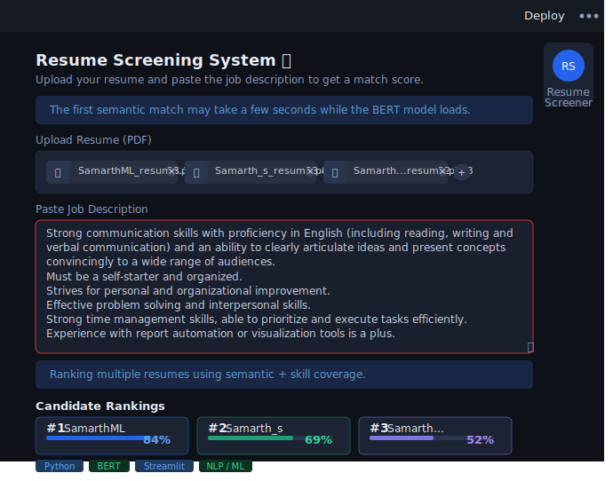

# Resume Screening NLP System

## Problem
Manual resume screening is time-consuming and inconsistent.

## Solution
An NLP-based resume screening tool that extracts text from resumes, uses BERT semantic embeddings to match against job descriptions, and provides skill analysis and ranking.

## Features
- Semantic matching using Sentence Transformers (BERT)
- Skill extraction and categorization (technical, tools, soft skills)
- Final match score combining semantic similarity and skill coverage
- Multi-resume upload and ranking
- Streamlit-based interactive UI for quick demos

## Tech Stack
- Python
- Streamlit
- Sentence Transformers (all-MiniLM-L6-v2)
- pdfplumber for PDF text extraction

## Requirements
Install the Python dependencies:

```bash
pip install -r requirements.txt
```

## How to Run
Start the Streamlit app:

```bash
streamlit run app.py
```

Open `http://localhost:8501` in your browser.

## Notes
- The first semantic match may take a few seconds while the BERT model downloads and loads. This is normal.
- The final score is a combination of semantic similarity (BERT) and skill coverage; both are normalized to a 0–1 scale and averaged, then displayed as a percentage.

## Example usage
- Upload one or more PDF resumes
- Paste the job description
- For multiple resumes, the app will rank candidates by final score

## Screenshot
.
## Advanced Features

- Fuzzy Skill Matching: Handles variations in skill names using similarity matching
- OCR Support: Extracts text from scanned resumes using Tesseract OCR
- Docker Deployment: Containerized application for easy deployment
- Top-3 Missing Skills Recommendation: Suggests the top three skills the candidate can learn to improve their match

## Limitations
- OCR accuracy depends on image quality
- Semantic matching depends on the chosen embedding model and may vary by phrasing

## Visuals
- Screenshot: assets/screenshot.svg (replace with your own screenshot)
- Demo GIF: assets/demo.gif (placeholder)

## License
MIT
